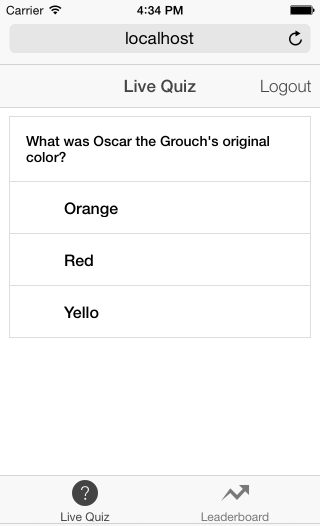
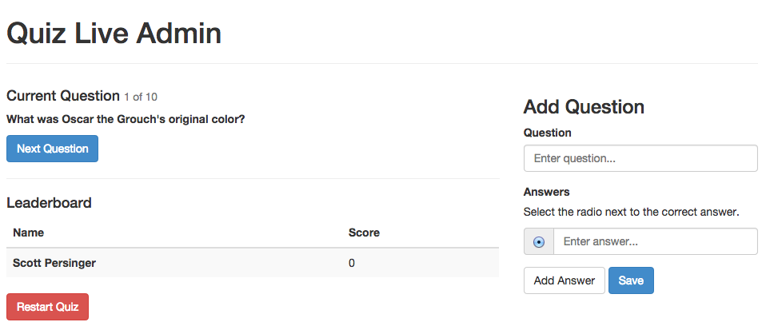

# Heroku template mobile app `Quiz Live`

This sample application implements a simple "live quiz" mobile game. The mobile
app itself is a hybrid AngularJS app composed of HTML, CSS and Javascript. The
server side is implemented as an Express Node.js application running on top of 
a Postgres database.

This application should serve as a good base for creating mobile apps to deploy on
Heroku.

## How to play

A set of players opens the app on their phones and registers to play. The app maintains 
this list of users plus a set of quiz questions. During the game, questions
are presented to each user running the app, and points are awarded for correct answers
to questions. As players earn points a realtime leaderboard is displayed to each
player.

Notification of new questions and answer results are broadcast via Websocket to the
mobile app using the SocketIO library.

**Game screenshot**

**Admin screenshot**

## Architecture

The app has two major pieces: An AngularJS based client app which comprises the front-end
which runs on the phone, and a Node.js backend which provides an API to the client app for 
user registration, data storage, and event broadcast.

    /---mobile app-----\
    | Ionic framework  |
    | Angular JS       |
    \------------------/
           |
           | http / websocket
           |
    /-------Node.js app-\
    |                   |
    | express           |
    |   bookshelf       |
    |      node-pg      |
    \-------------------/
           |
       [Postgres DB]

# Deployment

The app can be deployed to Heroku, and distributed to the mobile device either through
the mobile web browser, or by compiling the AngularJS application into a native app
using an Apache Cordova container.

# Installation and setup

Clone this repo to your local machine and install the requirements:

    npm install

Now create a database on your local server called
`quizlive`:

    createdb quizlive

Now create the database schema and initial data:

    ./bootstrap.sh

And now run the server app:

    node server.js

and open the client app:

    http://localhost:5000

From the home screen click "Register". Enter your name and email and click `Register`. The first user
is automatically marked as the administrator. Click the _Open Admin Page_ link on the quiz page.

On the admin page, use the following controls
 
`Next Question` - queue up the next quiz question
`Restart Quiz` - erase all current scores and start over

As you click `Next Question` a new question will appear automatically for anyone running
the app. Additional users can register for the app and play at the same time. Users accumulate
points by answering questions correctly, with a bonus awarded to the person who answers
correctly first.

# Deploy to Heroku

When you are ready to share the app, just create a new Heroku app, provision a Postgres
database addon for your app, and then deploy the code. After you deploy you should
bootstrap the database:

    $ heroku run ./bootstrap.sh

# Understanding the code

The components of the application are organized as follows:

| component | folder |
|------------|---------|
| client app | client |
| ..app code | client/js |
| ..html templates | client/templates |
| ..ionic/angular frameworks | client/lib | 
|            |        |
| express app | server.js, server/* |
| ..db migrations | server/migrations |    
| ..question list | server/load_question.js |
| admin app  | admin  |

## Front-end app

The front-end app is an AngularJS single page application. Thus all the HTML and Javascripted
are loaded and run in a single WebView control on the phone. Different screens and navigation
are all drawn in the browser DOM.

Angular

## Accessing Force.com

As an option, the app can be configured so that each person who registers to play is
recorded as a Lead record in Salesforce. This template shows how to access the 
Force.com API to exchange data with a Salesforce account. See [FORCE_README](docs/FORCE_README.md) 
for full instructions. 

# Debugging

Install `node-debug` to use the Chrome debugger with Node.js:

    $ npm install node-debug

And to use, just run with `node-debugger`. After the Chrome debugger opens, make sure to click `Run`
so the server starts:

    $ node-debug server.js

# Building a native app

To bundle your client app as a native mobile app, you can use the Cordova tool. Note that to build
a native app you will need the corresponding native build tools. So for iOS apps you will need
Xcode installed, and for Android apps you will need to have the Android SDK installed.

Install Cordova:

    $ sudo npm install -g cordova

Install an application simulator:

    $ sudo npm install -g ios-sim

Initialize the wrapper:

    $ mkdir wrapper
    $ cd wrapper
    $ cordova create . QuizLive
    $ rm -rf www
    $ ln -s ../client www

Now add one or more platform targets:

    $ cordova platform add ios
    $ cordova platform add android

Now build the native app:

    $ cordova compile ios

And run in the emulator:

    $ cordova run --emulator

## Fixing AJAX calls

The Ajax calls used in the Angular client are written using simple relative paths. This means that they automatically use the `host` value inferred from the domain which served the client JS files. This all works properly when the client app is served from a web server.

However, when you package the client files into the Cordova wrapper, then they are provided to the mobile device from the local filesystem, rather than being served from the web. As a result there is no `domain` to tell the Ajax calls where to go. To correct this, you need to specify your web domain explicitly in all client Ajax calls, such as the login call:

https://github.com/heroku/mobile-template1/blob/master/client/js/services.js#L80

# Contact

Scott Persinger <scottp@heroku.com>

# License

See LICENSE. This code is available under the MIT license.

